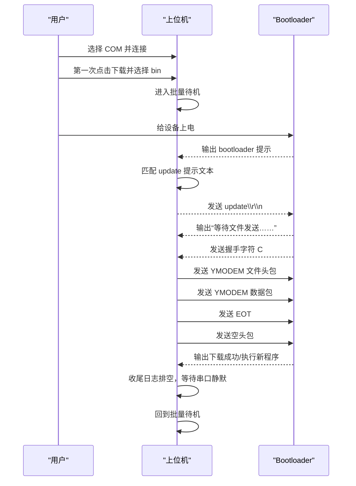

# 充电器升级上位机开发接手说明

## 1. 文档目的

本文档面向后续开发和维护人员，重点说明：

- 关键函数调用链
- 升级状态机时序
- bootloader 提示匹配点
- YMODEM 包格式和发送流程
- 后续修改时最容易出问题的位置

建议结合以下文件一起阅读：

- `src/main.cpp`
- `src/ymodem.cpp`
- `docs/SOFTWARE_ARCHITECTURE.md`

## 2. 主调用链

当前程序的主流程集中在 `src/main.cpp`，调用链如下：

### 2.1 程序启动

1. `WinMain`
2. `RegisterClassW`
3. `CreateWindowExW`
4. `wnd_proc`
5. `create_controls`

职责：

- 创建窗口
- 初始化按钮、状态文本、进度条、日志框
- 进入消息循环

### 2.2 用户连接串口

1. 用户点击“连接”
2. `wnd_proc -> WM_COMMAND`
3. `connect_or_disconnect`
4. `open_serial_port`

职责：

- 获取当前选中的 COM 口
- 打开串口
- 设置 `115200 / 8N1`
- 设置超时
- 切换 UI 状态

### 2.3 用户进入批量待机

1. 用户点击“下载”
2. `wnd_proc -> WM_COMMAND`
3. `start_download`
4. 首次进入时弹出文件选择框
5. 保存当前固件路径
6. 创建工作线程 `CreateThread`
7. 线程入口：`upgrade_thread_proc`

职责：

- 只在当前连接会话第一次点击下载时选择 `.bin`
- 后续同一批次复用当前固件路径
- 进入批量待机状态

### 2.4 工作线程中的核心升级链路

工作线程主循环如下：

1. `upgrade_thread_proc`
2. `wait_for_boot_prompt`
3. `write_all(..., "update\r\n")`
4. `wait_for_file_send_prompt`
5. `ymodem_send_file`
6. `drain_post_upgrade_output`
7. 返回第 2 步，等待下一台

其中：

- 第 2 步负责识别 bootloader 升级提示
- 第 4 步负责识别“等待文件发送……”或握手字符 `C`
- 第 5 步负责完整 YMODEM 文件发送
- 第 6 步负责收尾并等待串口静默，避免上一台残留日志干扰下一台

## 3. 升级状态机

可以把当前升级状态机理解成下面这些状态：

1. 未连接
2. 已连接
3. 固件已选择
4. 批量待机
5. 识别 bootloader 提示
6. 发送 `update`
7. 等待设备进入文件接收状态
8. YMODEM 发送中
9. 升级成功
10. 收尾日志排空
11. 回到批量待机

### 3.1 时序图

## 4. bootloader 提示匹配逻辑

这一部分是整个项目最关键的“入口判定”。

### 4.1 为什么不能看到任意串口输出就发 `update`

如果看到任意输出就发 `update`，会有几个问题：

- 可能误把普通运行日志当成 bootloader 提示
- 可能在错误时机发命令
- 在批量场景下，上一台升级尾日志可能会误触发下一轮升级

因此当前实现使用“明确文本匹配”。

### 4.2 关键匹配函数

在 `src/main.cpp` 中，当前有以下文本匹配点：

#### `text_contains_update_prompt`

用于识别是否进入 bootloader 升级提示窗口。

当前条件：

- 文本中包含 `update`
- 文本中包含 `开始升级程序`

#### `text_contains_wait_file_prompt`

用于识别设备是否已经在发送 `update` 后进入文件接收状态。

当前条件：

- 文本中包含 `等待文件发送`

#### `text_contains_boot_timeout_text`

用于识别设备是否已经错过升级窗口，开始加载内部程序。

当前条件：

- 文本中包含 `开始加载内部FLASH程序`

#### `tail_contains_receiver_request`

用于处理设备提示被拆包、中文没完全解析出来，但尾部已经出现握手字符 `C` 的场景。

作用：

- 提高健壮性
- 避免因为文本拆包导致卡死在“等待文件发送”阶段

### 4.3 为什么还要检测串口静默

单台升级完成后，设备通常还会输出：

- 下载成功
- 文件名
- 文件大小
- 开始执行新程序

如果这些输出残留在缓存中，下一轮设备上电时：

- 可能和新一轮 bootloader 提示拼接
- 可能导致上一轮文本被错误复用

因此当前实现加入了两个机制：

#### `SERIAL_IDLE_RESET_MS`

作用：

- 在等待下一台上电时，如果串口静默超过一定时间，清空当前捕获缓冲

#### `drain_post_upgrade_output`

作用：

- 一台升级成功后，先读取剩余串口输出
- 等待一段时间静默后再回到待机

这两个机制是当前“批量升级能连续稳定工作”的关键。

## 5. YMODEM 协议实现说明

YMODEM 逻辑在：

- `src/ymodem.h`
- `src/ymodem.cpp`

### 5.1 常量定义

协议里用到的关键控制字符：

- `SOH = 0x01`：128 字节包
- `STX = 0x02`：1024 字节包
- `EOT = 0x04`：文件结束
- `ACK = 0x06`
- `NAK = 0x15`
- `CAN = 0x18`
- `CRC_REQUEST = 'C'`
- `CPMEOF = 0x1A`

### 5.2 当前发送流程

#### 第一步：等待接收端握手

函数：

- `wait_control_response`

行为：

- 等待 bootloader 发出 `C` 或 `NAK`
- 如果超时则失败

#### 第二步：发送文件头包

函数：

- `build_header_payload`
- `send_packet_wait_ack`

内容：

- 文件名
- 文件大小

说明：

- 文件头固定使用 128 字节包

#### 第三步：发送数据包

函数：

- `send_packet`
- `send_packet_wait_ack`

规则：

- 数据长度大于 128 字节时优先使用 1024 字节包
- 小于等于 128 字节时使用 128 字节包
- 未满的部分使用 `0x1A` 填充

#### 第四步：发送 EOT

行为：

- 发送 `EOT`
- 如果收到 `NAK`，再次发送 `EOT`
- 直到收到 `ACK`

#### 第五步：发送空头包结束批传输

行为：

- 等待接收端再次发出 `C`
- 发送 block 0 空头包
- 完整结束 YMODEM 传输

### 5.3 CRC 校验

函数：

- `crc16_ccitt`

说明：

- 当前使用 CRC16-CCITT
- 每个包发送前都对完整 payload 计算 CRC

### 5.4 重试机制

函数：

- `send_packet_wait_ack`

当前策略：

- 每个数据包最多重试 10 次
- 收到 `NAK` 则重发
- 收到 `CAN` 则终止

### 5.5 当前假设

当前 YMODEM 实现基于以下假设：

- bootloader 为单文件升级模式
- 文件大小小于 4GB
- 文件头中使用 ANSI 文件名即可
- 接收端遵循标准 YMODEM 基本握手流程

## 6. UI 双版本设计

当前通过编译宏 `SIMPLE_UI` 生成两套前端：

### 6.1 调试版

特点：

- 显示日志框
- 保留完整串口输出
- 保留调试提示
- 便于排查 bootloader 时序问题

适合：

- 开发调试
- 现场联调
- 分析失败原因

### 6.2 用户版

特点：

- 不显示详细串口日志
- 使用大状态字
- 使用进度条
- 统计已成功升级台数
- 提示语更少、更醒目

适合：

- 普通操作员
- 产线批量升级

### 6.3 为什么不拆成两个项目

当前没有拆成两个独立工程，而是用一套核心逻辑配两个 UI 分支，原因如下：

- 协议逻辑只维护一份
- 避免调试版和用户版逻辑漂移
- 修复 bug 时只需要改一套主流程
- 构建脚本同时产出两个 exe 即可

## 7. 修改时最容易踩坑的地方

### 7.1 修改 bootloader 提示词

风险：

- 文本匹配条件变窄，导致不触发升级
- 文本匹配条件变宽，导致误触发

建议：

- 修改前先保留调试版日志
- 先在调试版验证多次，再同步到用户版

### 7.2 修改串口超时

风险：

- 超时过短会误判失败
- 超时过长会让操作员等待太久

建议：

- 以 bootloader 实际行为为准
- 分阶段调整，而不是只改一个总超时

### 7.3 修改批量待机逻辑

风险：

- 处理不好升级成功后的尾日志
- 下一台设备上电时识别条件被上一台残留输出污染

建议：

- 不要轻易删除 `drain_post_upgrade_output`
- 不要轻易删除串口静默重置逻辑

### 7.4 修改 YMODEM 包结构

风险：

- 头包格式错误会导致设备不接收
- CRC 处理错误会导致反复 NAK
- EOT 收尾错误会导致文件虽然下载了，但升级状态不完整

建议：

- 修改前准备一份稳定可回归的固件
- 每次修改后先验证：
  - 小文件
  - 较大文件
  - 连续批量升级

## 8. 建议的后续重构方向

如果后面要继续演进，建议按下面顺序做：

### 第一步：抽离文本匹配模块

把以下内容单独拆出来：

- bootloader 提示识别
- 文件接收提示识别
- 错过升级窗口识别

好处：

- 便于适配不同 bootloader 版本
- 便于做模拟测试

### 第二步：抽离升级状态机模块

可以单独做 `upgrade_engine.*`

负责：

- 状态切换
- 超时控制
- 线程停止控制
- 成功/失败上报

### 第三步：抽离串口模块

可以单独做 `serial_port.*`

负责：

- 打开/关闭
- 读写
- 超时
- 清缓冲

### 第四步：增加升级结果记录

建议新增：

- 时间
- 固件名
- 串口号
- 成功/失败
- 失败原因

## 9. 推荐阅读顺序

如果你后面要继续研究源码，建议按下面顺序看：

1. `build_mingw32.bat`
2. `src/main.cpp` 中的 `WinMain`
3. `create_controls`
4. `connect_or_disconnect`
5. `start_download`
6. `upgrade_thread_proc`
7. `wait_for_boot_prompt`
8. `wait_for_file_send_prompt`
9. `drain_post_upgrade_output`
10. `src/ymodem.cpp` 中的 `ymodem_send_file`
11. `send_packet_wait_ack`
12. `crc16_ccitt`

这样从 UI 到状态机，再到协议层，会比较顺。

## 10. 结论

当前项目最核心的设计思想可以概括成一句话：

**用最少依赖实现可控、可批量重入、适合老 Windows 的充电器升级链路。**

真正需要重点保护的不是界面，而是下面这三件事：

1. bootloader 升级窗口识别是否准确
2. `update` 到“等待文件发送”的过渡是否稳定
3. 升级完成后到下一轮待机的重入是否干净

只要这三点不被破坏，这套上位机就能持续稳定工作。
